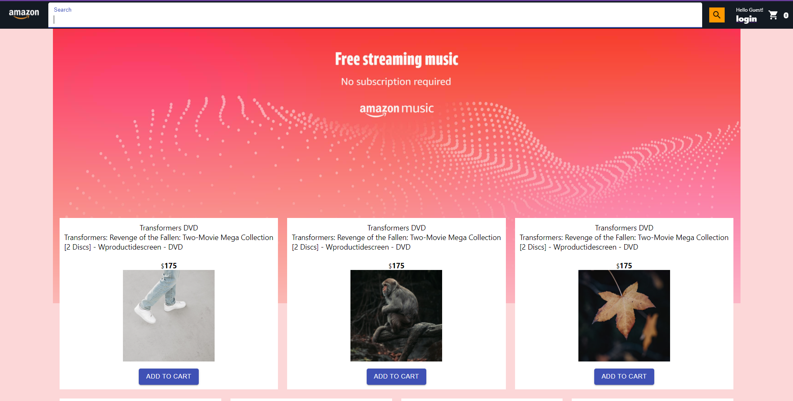
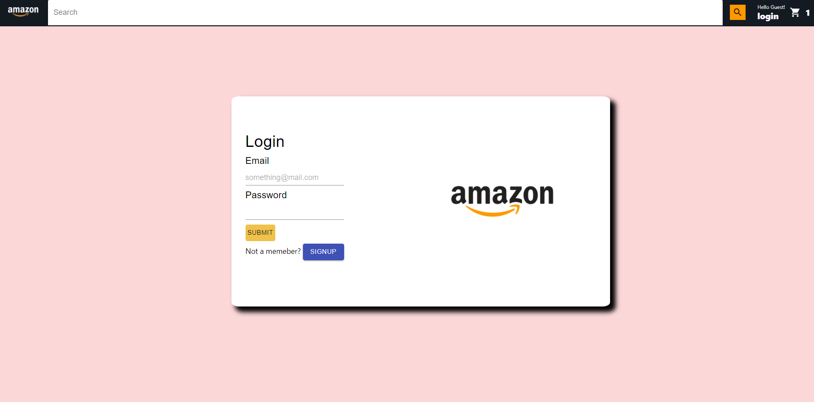
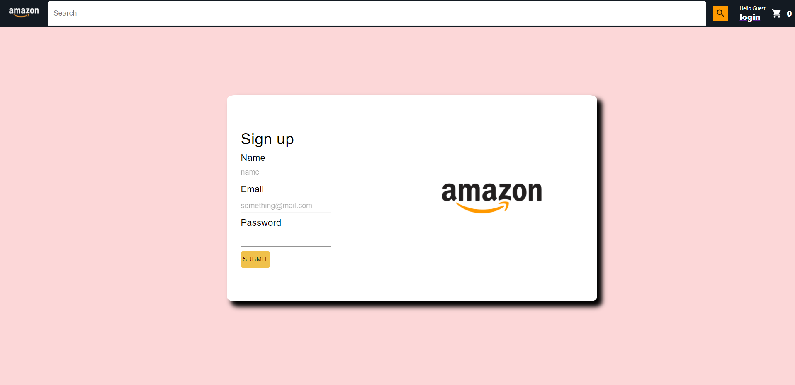
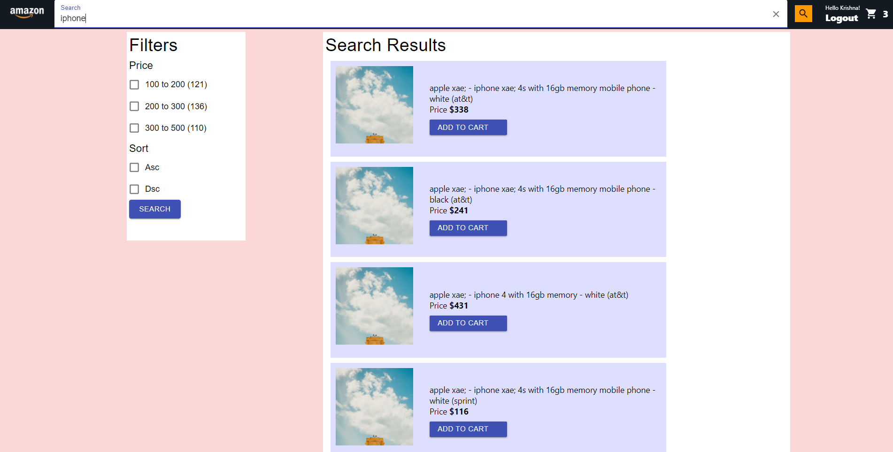
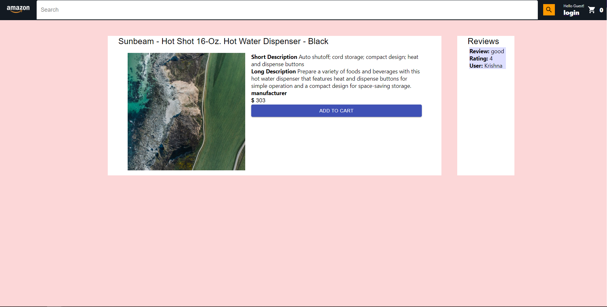
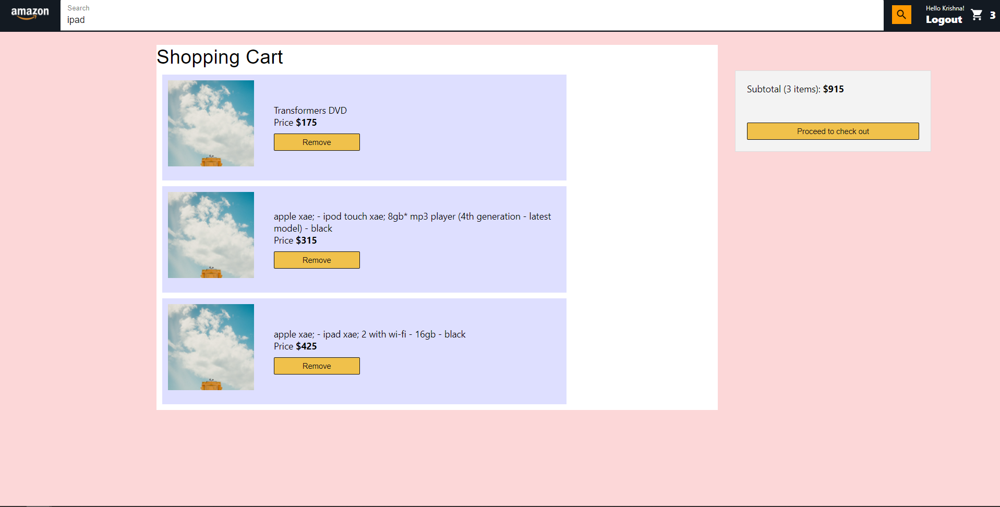
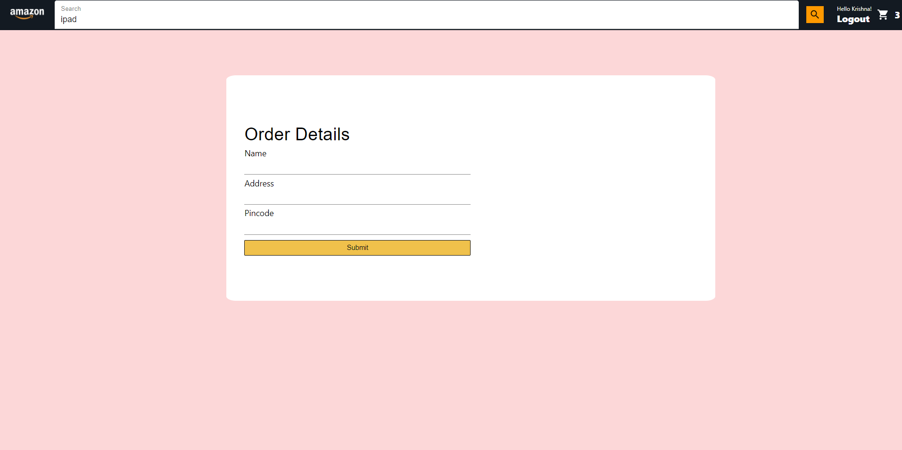

# E Commerce Site

# Client

The frontend is built using React(Hooks), Entire react app is Wrapped around a context api, that keep track of the state in the application. Reducer is used to keep track of complex state changes  
The front end has Ten pages 

<ol>
  <li>Home</li>
  <li>Search Page</li>
  <li>Cart Page</li>
  <li>Item (Product page with it's description and Reviews)</li>
  <li>Checkout Page</li>
  <li>Order Page</li>
  <li>Login</li>
  <li>Signup</li>
  <li>404</li>
  <li>Unauthorized</li>
</ol>
Home page is used to display popular products
 
Search page is used to show the search results, facets are also provided to filter the search results
 
Cart Page is used to show all items placed in the cart and the total cost for the products in the cart
 
Checkout page collects all the shipping details, order page is used to display the order confirmation
 
Login page for the user to login, and sign up page to register

# Backend

The backend is build using Node and express, There are Six routes
 

<ol>
<li>auth Route</li>
<li>cart Route</li>
<li>order Route</li>
<li>product Route</li>
<li>review Route</li>
<li>search Route</li>
</ol>
We are using jwt for session management, We are using Elasticsearch learning to rank library with XGboost Model

# Database

Postgres is used as the database for this project, commands for sql can be found in
<a href="https://github.com/Kshashum/Retro/blob/main/backend/postgres/db.sql" target="_blank">DB commands</a>
 
Data Ingestion for elastic search is done using the elasticIngest function in the elastic folder.
 

The start commands for the frontend and backend are provided in their individual readme sections
 
<a href="https://github.com/Kshashum/HotelReviewsDocker/blob/main/backend/README.md" target="_blank">Backend</a>
 
<a href="https://github.com/Kshashum/Retro/blob/main/client/README.md">Frontend</a>

# Images

## Landing Page

 

## Login Page

 

## Signup Page

 

## Search Page

 

## Product Page

 

## Cart Page

 

## Checkout Page

 
